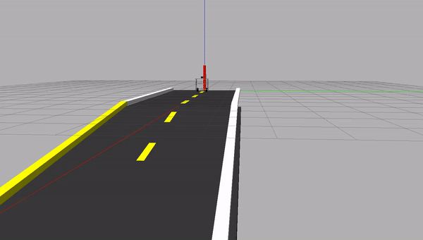

# two_wheel_robot

A self-balancing two-wheel robot for **ROS 2 Humble + Gazebo Classic 11**.

Generated from a SolidWorks 2026 STEP export via FreeCAD, packaged with `xacro`,
`ros2_control` (effort interface), and a cascade-PD balance controller.

It balances on flat ground, **climbs an 8° ramp**, and **descends an 8° decline**
while self-balancing the whole way.

```
description/                 xacro robot description (split into 4 files)
config/controllers.yaml      ros2_control: joint_state_broadcaster + effort_controllers
worlds/empty.world           ground plane + sun, 1 kHz ODE physics
worlds/road.world            18 m straight road with kerbs and start/end markers
worlds/road_slope.world      flat → 8° uphill ramp → plateau
worlds/road_downslope.world  flat top → 8° decline → lower flat
launch/view.launch.py        RViz only, no physics
launch/gazebo_view.launch.py Gazebo paused, CAD mesh visual inspection
launch/gazebo_teleop.launch.py Gazebo paused, CAD mesh keyboard teleop demo
launch/gazebo.launch.py      Gazebo + ros2_control + balance controller
launch/road.launch.py        autonomous straight-road driving demo
launch/road_slope.launch.py  uphill ramp-climb scenario
launch/road_downslope.launch.py  downhill descent scenario
launch/teleop.launch.py      keyboard teleop in an xterm
scripts/balance_controller.py  cascade-PD self-balancing controller
meshes/                      base_link.stl + L/R wheel STLs (in meters)
rviz/view.rviz               minimal RViz layout
docs/                        slope-balancing report (md + pdf) and debug log
media/                       demo recordings (flat road, slope) + preview gif
```

## Demo

The robot driving the flat road, then climbing and descending the 8° slopes:



Full-resolution recordings:

- [`media/flat_road_demo.mp4`](media/flat_road_demo.mp4) — autonomous flat-road drive
- [`media/slope_demo.mp4`](media/slope_demo.mp4) — uphill climb and downhill descent

## Documentation

- **[Slope Balancing Report](docs/Slope_Balancing_Report.md)** ([PDF](docs/Slope_Balancing_Report.pdf)) —
  a full technical write-up of the engineering problems, root-cause analysis and control solutions
  behind the flat / uphill / downhill balancing.
- **[Debug Log](docs/DEBUG_LOG.md)** — chronological development notes and bug fixes.

## Robot summary

| Quantity | Value |
|---|---|
| Wheel radius | 0.075 m |
| Wheel width | 0.050 m |
| Wheel separation | 0.345 m |
| `base_link` mass | 12.11 kg |
| Wheel mass | 0.585 kg each |
| `base_link` COG height | 0.293 m above ground |
| Pendulum natural freq | √(g/L) ≈ 6.7 rad/s ≈ 1.06 Hz |
| Control loop rate | 200 Hz |
| Physics step | 1 ms (1 kHz) |

---

## One-time setup on Ubuntu 22.04 (WSL or native)

If you're on Windows, install WSL2 + Ubuntu 22.04 first:

```powershell
# in Windows PowerShell as Administrator
wsl --install -d Ubuntu-22.04
# reboot, then set up a username/password when Ubuntu opens
```

From here on, **every command runs inside Ubuntu**.

### Install ROS 2 Humble + Gazebo Classic + ros2_control

```bash
# Locale
sudo apt update && sudo apt install -y locales curl gnupg lsb-release software-properties-common
sudo locale-gen en_US en_US.UTF-8
sudo update-locale LC_ALL=en_US.UTF-8 LANG=en_US.UTF-8
export LANG=en_US.UTF-8

# ROS 2 apt source
sudo add-apt-repository universe -y
sudo curl -sSL https://raw.githubusercontent.com/ros/rosdistro/master/ros.key -o /usr/share/keyrings/ros-archive-keyring.gpg
echo "deb [arch=$(dpkg --print-architecture) signed-by=/usr/share/keyrings/ros-archive-keyring.gpg] http://packages.ros.org/ros2/ubuntu $(. /etc/os-release && echo $UBUNTU_CODENAME) main" \
    | sudo tee /etc/apt/sources.list.d/ros2.list > /dev/null
sudo apt update

# Everything we need
sudo apt install -y \
    ros-humble-desktop \
    ros-humble-gazebo-ros-pkgs \
    ros-humble-gazebo-ros2-control \
    ros-humble-ros2-control \
    ros-humble-ros2-controllers \
    ros-humble-joint-state-broadcaster \
    ros-humble-effort-controllers \
    ros-humble-xacro \
    ros-humble-robot-state-publisher \
    ros-humble-joint-state-publisher-gui \
    ros-humble-rviz2 \
    ros-humble-teleop-twist-keyboard \
    python3-colcon-common-extensions \
    xterm

# Source ROS in every shell
echo "source /opt/ros/humble/setup.bash" >> ~/.bashrc
source ~/.bashrc
```

### Build the workspace

```bash
mkdir -p ~/ros2_ws/src
cp -r /mnt/c/Users/prajw/Downloads/urdf_work/two_wheel_robot ~/ros2_ws/src/

cd ~/ros2_ws
colcon build --packages-select two_wheel_robot --symlink-install
echo "source ~/ros2_ws/install/setup.bash" >> ~/.bashrc
source ~/ros2_ws/install/setup.bash
```

Expected: `Summary: 1 package finished` with no errors.

---

## Run it

### Full balancing simulation

```bash
ros2 launch two_wheel_robot gazebo.launch.py
```

You will see, in order:
1. Gazebo Classic GUI opens with an empty world.
2. The robot drops in 8 cm above the ground.
3. Three spawner processes flash by in the terminal:
   `joint_state_broadcaster` → `effort_controllers` → `balance_controller`.
4. The robot stabilises upright. If the gains are wrong for your sim it will
   fall over — see **Tuning** below.

### Drive it (after it's standing)

In a second terminal:

```bash
source ~/ros2_ws/install/setup.bash

# Forward at 0.2 m/s, turning at 0.5 rad/s
ros2 topic pub /cmd_vel geometry_msgs/msg/Twist \
    "{linear: {x: 0.2}, angular: {z: 0.5}}" -r 10

# Stop
ros2 topic pub --once /cmd_vel geometry_msgs/msg/Twist \
    "{linear: {x: 0}, angular: {z: 0}}"
```

Or use keyboard teleop:

```bash
ros2 launch two_wheel_robot teleop.launch.py
# follow on-screen instructions in the xterm window
```

### View in RViz (no physics)

```bash
ros2 launch two_wheel_robot view.launch.py
```

A `joint_state_publisher_gui` slider lets you spin the wheels by hand.

### View in Gazebo (paused, no controller)

```bash
ros2 launch two_wheel_robot gazebo_view.launch.py
```

Use this to inspect the URDF model in Gazebo without the self-balancing
physics/controller immediately tipping it over.

### Keyboard teleop in Gazebo

```bash
ros2 launch two_wheel_robot gazebo_teleop.launch.py
```

Use the xterm teleop window:

```text
i forward     , backward
j turn left   l turn right
k stop
q/z speed up/down
```

---

## Tuning the balance controller

All gains are ROS 2 parameters; change them live without restarting:

```bash
# stiffer balancing
ros2 param set /balance_controller kp_pitch 60.0
ros2 param set /balance_controller kd_pitch 6.0

# faster velocity tracking
ros2 param set /balance_controller kp_vel 0.30

# if forward lean reads negative pitch, flip the sign
ros2 param set /balance_controller pitch_sign -1.0

# list everything that's tunable
ros2 param list /balance_controller
```

### Defaults and what each does

| Parameter | Default | Effect |
|---|---|---|
| `kp_pitch` | 45 | Pitch error → torque. Higher = aggressive righting. Too high → wheel chatter. |
| `kd_pitch` | 4 | Damps pitch motion. Too high → sluggish, amplifies sensor noise. |
| `kp_vel` | 0.20 | rad of commanded lean per m/s velocity error. |
| `ki_vel` | 0.05 | Integral on velocity error (with conditional anti-windup). |
| `k_yaw` | 0.35 | Differential torque per rad/s yaw rate error. |
| `pitch_sign` | +1 | Set to −1 if forward-leaning robot reads as negative pitch. |
| `pitch_offset` | 0 | Subtract from measured pitch (IMU mounting bias). |
| `max_lean` | 0.15 rad (≈8.6°) | Caps the commanded lean to prevent over-aggression. |
| `max_torque` | 3.0 N·m | Per-wheel torque saturation. |
| `safety_pitch` | 0.60 rad (≈34°) | Past this, controller brakes (won't try to recover). |
| `recovery_pitch` | 0.20 rad | Re-arms once pitch falls below this AND wheels are nearly stopped. |
| `brake_kv` | 0.10 | Brake gain when tipped (tau = −brake_kv × wheel_velocity). |

### Tuning recipe (proven order)

1. **Verify pitch sign first.** Echo the IMU and lean the robot manually in
   Gazebo (you can grab a link with the mouse and tilt it):
   ```bash
   ros2 topic echo /imu --field orientation
   ```
   Compute pitch ≈ `2·asin(orientation.y)` — leaning forward should read
   *positive*. If it doesn't, set `pitch_sign: -1`.
2. **Inner loop only.** Set `kp_vel=0`, `ki_vel=0`, `k_yaw=0`. Raise `kp_pitch`
   slowly (35 → 60) until the robot resists pushes well. Add `kd_pitch` (start
   at `kp_pitch / 10`) to damp oscillations.
3. **Velocity tracking.** Bring `kp_vel` up gradually (0.1 → 0.3). Send a small
   step (`linear.x = 0.1`); the robot should reach steady velocity in ~2 s with
   minimal overshoot. `ki_vel` cleans up steady-state drift, especially on
   slopes.
4. **Yaw.** Send `angular.z = 0.5`. Bump `k_yaw` until turns are crisp without
   yaw oscillation.

### Why does it briefly go BACKWARDS when I command forward?

It's an inverted-pendulum vehicle — *non-minimum-phase*. To move forward, the
chassis must first lean forward; to *make* it lean forward, the wheels briefly
drive backward to tip it. Then the inner loop drives them forward to chase
the lean. This is correct behavior.

---

## Architecture

```
                  /cmd_vel  (geometry_msgs/Twist)
                       |
                       v
                  balance_controller         (cascade PD, 200 Hz)
                       |
                       v
        /effort_controllers/commands       (Float64MultiArray [τ_L, τ_R])
                       |
                       v
              effort_controllers           (ros2_control)
                       |
                       v
            GazeboSystem hardware           (gazebo_ros2_control)
                       |
                       v
                Gazebo Classic              (ODE physics, 1 kHz step)
                       |
       +---------------+-----------------+
       v               v                 v
   joint encoders   IMU sensor       contact dynamics
       |               |
       v               v
  /joint_states    /imu                  (back to controller)
```

---

## Files in detail

### `description/robot.urdf.xacro` (top level)

```xml
<xacro:include filename="$(find two_wheel_robot)/description/inertial_macros.xacro"/>
<xacro:include filename="$(find two_wheel_robot)/description/robot_core.xacro"/>
<xacro:if value="$(arg use_sim)">
  <xacro:include filename=".../ros2_control.xacro"/>
  <xacro:include filename=".../gazebo.xacro"/>
</xacro:if>
```

Pass `use_sim:=false` for a pure-kinematic URDF (no Gazebo / no ros2_control)
suitable for RViz, MoveIt setup assistant, or third-party URDF importers.

### `description/robot_core.xacro`

All link/joint definitions. Single source of truth for `wheel_radius`,
`wheel_separation`, masses, etc. — change one number, regenerate URDF, every
launch picks it up.

### `description/ros2_control.xacro`

Hardware interface declaration. Each wheel gets:
- `command_interface: effort` (limits ±10 N·m)
- `state_interface: position, velocity, effort`

### `description/gazebo.xacro`

- `libgazebo_ros2_control.so` plugin (instantiates the ros2_control system)
- `libgazebo_ros_imu_sensor.so` on `imu_link` (publishes `/imu` at 200 Hz)
- Per-link friction (`mu1`, `mu2`), contact stiffness (`kp`, `kd`)

### `config/controllers.yaml`

- `joint_state_broadcaster` → publishes `/joint_states`
- `effort_controllers` (`JointGroupEffortController`) → consumes
  `Float64MultiArray` on `/effort_controllers/commands`

---

## Troubleshooting

| Symptom | Cause | Fix |
|---|---|---|
| `Package 'two_wheel_robot' not found` | workspace not sourced | `source ~/ros2_ws/install/setup.bash` |
| Robot spawns but doesn't move at all | controllers not loaded | check `ros2 control list_controllers` — should show 2 active |
| `Failed to load controller 'effort_controllers'` | wrong plugin name in yaml | look for typo in `controllers.yaml` |
| `Unknown tag 'ros2_control'` warning | benign — `urdf_parser_py` doesn't know that tag, but ros2_control does | ignore |
| Wheels spin both same direction, robot doesn't balance | pitch sign wrong | `ros2 param set /balance_controller pitch_sign -1.0` |
| Robot oscillates wildly | gains too high | halve `kp_pitch`, retune |
| Robot flops over immediately | gains too low, or sign wrong | first try sign flip, then raise `kp_pitch` |
| `RLException: Couldn't process file ...xacro` | xacro syntax error in the file you just edited | run `xacro description/robot.urdf.xacro use_sim:=true` to see the error |
| Gazebo crashes on launch | GPU driver issue in WSL | `export LIBGL_ALWAYS_SOFTWARE=1` before launching |
| Robot drifts slowly even with `cmd_vel=0` | IMU mounting bias | log resting pitch, set `pitch_offset` to that value |

---

## Limitations and known sim-to-real gaps

- **No motor model.** `effort_controllers` applies exactly what's asked. Real
  DC motors saturate, have back-EMF, and lose torque at high RPM. For sim-to-
  real, add a torque-vs-speed clip in the controller.
- **Material densities are heuristics** from CAD part names (Al 2700 / steel
  7850 / rubber 1100 kg/m³). Chassis mass is probably within ±20 % of reality;
  override in the rebuild script if you have measured values.
- **Battery, electronics, wiring are NOT in the CAD** — they'll shift the COG
  upward and add ~1–2 kg. Most critical for balance: a different COG height
  changes the pendulum natural frequency, which means re-tuning.
- **Inertia is closed-form** (box for chassis, cylinder for wheels) — accurate
  for the diagonal moments but ignores any product-of-inertia coupling. Fine
  for balancing; not fine for high-bandwidth dynamics work.
- **No state estimator.** Pitch is read raw from the IMU quaternion. On real
  hardware add a complementary filter or EKF (accelerometer gives drift-free
  tilt, gyro gives clean rate — fuse them).
- **No LQR.** Cascade PD is fine for proof-of-concept; for a tighter
  controller, derive the linearised A, B matrices from the robot constants
  and solve LQR offline.

---

## License

MIT. CAD model belongs to its original author.
